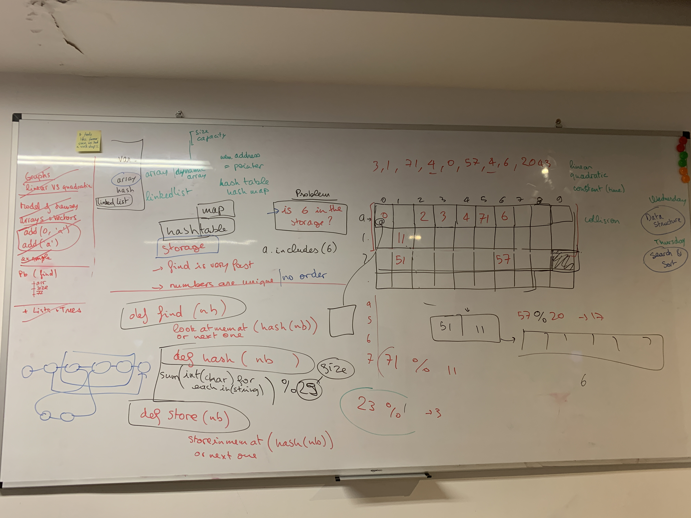

# Data structures

## Graphs

Linear vs quadratic vs exponential vs constant

- **quadratic** - curving upwards
- **linear** - constant time - straight line
- **exponential** - quickly going up from the start
- **constant** - straight flat line

look at worst case - e.g. for duplicates - do it for when there are no duplicates

we want linear - looking at how it will perform on largest array

most inbuilt functions are linear or close to linear.

It will be quadratic with things like 2 dimensional array - so with each loop, it will grow in complexity with each loop - grows in squares

2 => 4
4 => 16
8 => 64

grows faster than a line - not 1:1

## Data structures
- Array
- hash
- list/linked list

memory of a computer - mental representation - blocks (think about defragging the memory - and the visualisation)

addresses of memory - hexadecimal 0xfa980d2 - pointer

base10
|   |   |   |   |   
-----------------
|   |   |   |   |   
-----------------
|   |   |   |   |   
-----------------
|   |   |   |   |   
-----------------
|   |   |   |   |   
-----------------
|   |   |   |   |

1 bit = 0 or 1 - up to 255 integer - more precision - more space
8 bits = byte   
32 bit
64 bit - each memory address is encoded over 64 bits

for example
each cell stores 64 bits
can store 1 number or 1 character or 1 pointer/address

### create variable

var a = 7
a => @0 (address 0)
and will put 7 in the position 0 in th 'grid'

var b = a
b => @0
or
b => @1
most languages make default choices to pass by value (2nd option)
but sometimes it uses the reference (1st option)

### array stored in memory
var arr = []
arr => @3

does it need to specify size - e.g some languages (C, C#, etc - asks for size of array when created) - if so it will keep the memory free for it

arrays are stored sequentially - so can work out the nth item in the array and it's address quickly as it's array start address + length of array to get the last one.  This is why our .last graph is a **constant** straight flat line.

- primitive array - has a fixed size specified at the start
- dynamic array - may need to remap every time you add a new number to it to keep it sequential - in languages with dynamic arrays.  Remap and copy the data.

size = number of elements in array
capacity = how much space allocated for array in memory

e.g
arr[1,2]
- size = 2
- capacity = ? - depends on implementation of language.  Ruby for example is 5 or 6 initially

arr + 1,2,3,4,5,6,7
- size = 9
- capacity = maybe 12 - or adds on the default length to the size

common strategy is to double capacity each remap - 6 > 12 > 24 > 48
more you store data - more probable you will add more data

when remap - previous data is still there, but marked as free so it can be overwritten.

when remove items from it, it will reduce the size but not the capacity.

if no sequential blocks available can get an **out of memory exception**

**memory leak** - doesn't give back the memory that it's not using - depending on language - some may take care of this - but others don't - C++ for example you allocate space - need to deallocate.  Ruby/Js doesn't do this.  When not a lot of memory available makes sense to use a language that allows you to control it more - e.g. C etc

add item at the end
- checks for space (capacity vs size)
- initial address, plus length of array, add it to the end
- 2 operations - **linear**

add item at beginning (prepend)
- check space
- move each item along to make space
- <size of array> * operation - **linear** - bigger array, longer it will take

some languages let you check the memory and if there is a block before it can be made to use that.  So if you know you will regularly be adding items to the start of the array you could leave space for it.

array.find(1) - has to check each - **linear**

array.deleteAt(0) - remap everything to shift back
delete at end, easier
delete in middle - shift those indexes after **quadratic** - as depending on where the index is it could take longer or shorter

**shuffle** - slow example
newArr = []
select random element in size of array
r = random number
arr[r]
push into empty array
newArr.push(arr[r])
delete that element from initial array
while arr.length > 0

**shuffle** - better example
select random
copy to new array
swap this random element to the end in the original array
delete from end or original array

swapping is a common optimisation for array algorithms

### Problem - is 6 in the storage?
-----------------------------------------
| 1 | 2 | 3 | 4 | 5 | 6 |   |   |   |   |   
-----------------------------------------
|   |   |   |   |   |   |   |   |   |   |   
-----------------------------------------
|   |   |   |   |   |   |   |   |   |   |   
-----------------------------------------

array.includes(6)  
it iterates over the array - so will take a long as the array.length

finding something in an array is not efficient

Another data structure may be better.  Arrays created for storing sequential things - but not finding

#### potential options
- sort + find 6 - sort could be inefficient - will have to iterate over the array - as fast as finding, or maybe slower
- sort at creation - to optimize when and where you do the more intensive operations.  sacrifice at creation to make finding faster.

hash/object
**hashtable** (no value, just keys)
**hash map** - (hash in ruby) key and value.  Keys stored like a table, value stored at location in memory
hash[6]

**hashing function** - takes a number and makes a calculation and returns something that can be used as address
e.g. num%20 - store in memory @hash of number

can cause issues of collision

something in 11
51%20 is 11
collision - store it next to it

to find the number you look at memory at hash number - if not there look at next etc

with not a lot of numbers this may work - but then increases operations

you would remap maybe with a different modulo to remap - have a set of accepted collisions and if gets to bit it remaps

with a string it may have to take hexadecimal of each character or similar - sum it up and do modulo 29

**hashtable** - no order, finds things quickly

