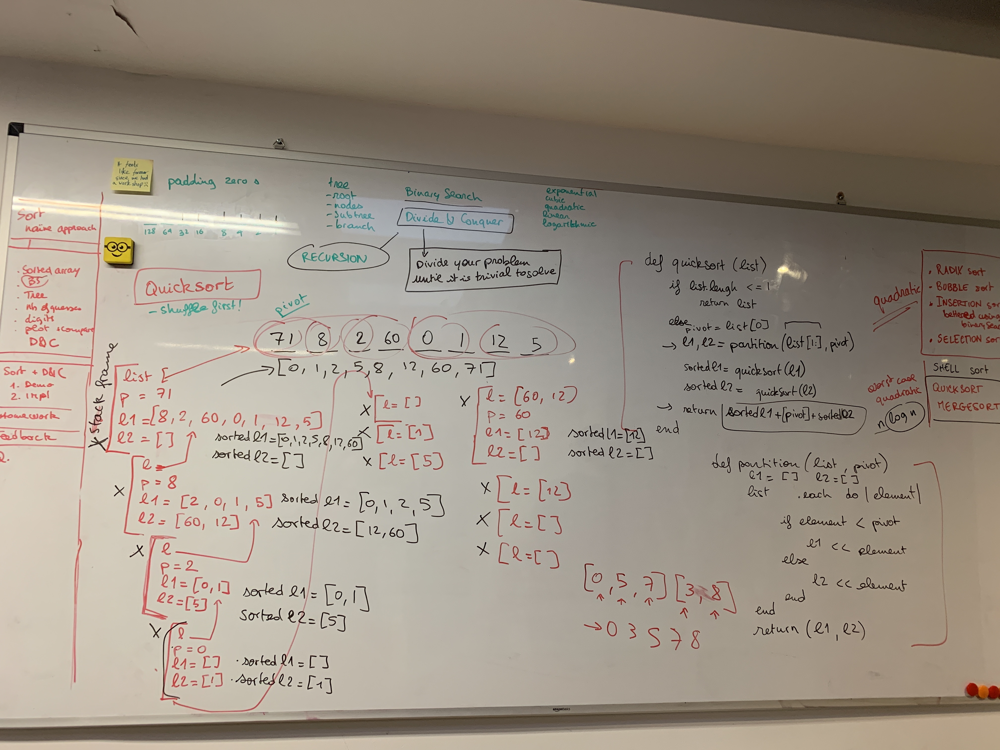

# Sorting Algorithms

##Sort - naive approach

How would you sort a physical list?

Examples -


### Radix sort
radix means root - looking at first letter digit - you add **padding zeros** to be the same length, and then sort into buckets

sorting books:
- Bert
- Abbott
- Frank
- Aaron

classify into buckets by letter
- A = Abbott, Aaron
- B = Bert
- C
- D
- ...
- F = Frank

Then sort each bucket
A = Aaron, Abbott

Then concatenate them together in order

====

### Bubble sort
3, 7, 1, 8, 2, 5

====
### Insertion sort
one of the best if there's a constant stream of things coming in - not the fastest

**Can be bettered using binary search**

3, 7, 1, 8, 2, 5

====
### Selection sort/Select sort

Go over the list - find the smallest one
put in new list
find minimum
put in the new list
etc

===

All the above are quadratic - can be low but ok for short list

for loop
  for loop


======

Is 5 in the array?
```
-----------------------------------------------
| 2 | 4 | 4 | 5 | 10 | 12 | 23 | 24 | 27 | 32 |  
-----------------------------------------------
```
if you have an array that you know is sorted, how can you find out if there is a number in the array

pick a middle number

is 5 less than that?  yes

half the first section

is 5 is less than that? no

look at the upper part of this section

How about 6?
```

               10
          4           24   
      2     4       12       27
    x     x   5    x  23    x  32
               x        x         x
```
for an array of 10 numbers - max number of checks is number of levels - in this case 5

<!-- 10 => 5 -->

**tree**
root
node
subtree
branch - path down the tree
```
-----
|   |
-----
```
1 => 2
```
-----------------------------------------------
|   |   |   |
-----------------------------------------------
```
3 => 3
```
-----------------------------------------------
|   |   |   |   |   |   |   |
-----------------------------------------------
```
7 => 4

<!-- 10 => 5 -->

15 => 5

31 => 6

63 => 7

double and add one number at the top

127 => 8

2 to power (n-1) - elements covered
n guesses

**Binary search** - logarithmic algorithm - preferred

if you write 127 in binary - it will take 8 digits

10 in binary
```
        1    1    1 0 1 0
128 63  32  10    8 4 2 1
```

**less than linear**

**logarithmic curve** log 2(n)

quadratic example - n squared

exponential - reverse of logarithmic

we should care about
- quadratic - worse
- linear - better
- logarithmic - best

## Divide and conquer

cut into smaller things and solve that, on and on
until problem to solve is trivial

won't always be logarithmic, but will be faster

### Shell sorting - read up on


Examples
```
-----------------------------------------------
| 71 | 8 | 2 | 60 | 0 | 1 | 12 | 5 |
-----------------------------------------------
```
### Quick sort - worst case is quadratic (unlucky)
half it
x < 60, put on the left, x > 60, put on right

[8,2,0,1,12,5] [71]
then 0

x < 0 || x > 0
[] [8,2,1,12,5] [71]

then 1
x < 1 || x > 1
[] [] [8,2,12,5] [71]

then 2
x < 2 || x > 2
[] [] [] [8,12,5] [71]

then 12
x < 12 || x > 12
[] [] [] [8,5] [12] [71]

then 5
x < 5 || x > 5
[][][][]

#### Classic quick sort
```
-----------------------------------------------
| 71 | 8 | 2 | 60 | 0 | 1 | 12 | 5 |
-----------------------------------------------
```
Take first number - **pivot** - worst case when reverse sorted or already sorted

before quick sort you should shuffle

average complexity in n log (n)

could use **recursion** to put it back together

**recursion**

```
def myFunction (list) {
  if problem is trivial
    return solution
  else
    cut problems in parts (list1, list2)
    return merging of myFunction(list1) and myFunction(list2)
}

function takes a list
  if trivial (maybe list.length <= 1)
    solution is just the list
  else
    cut problem - needs thinking about - how to **partition**
    run the function again on list 1 etc
```

Only things to think about is how to define trivial
how to partition
how to merge

This generic code will be the same for all divide and conquer

##### Alice's algorithm

```
-----------------------------------------------
| 71 | 8 | 2 | 60 | 0 | 1 | 12 | 5 |
-----------------------------------------------
```
```
def quickSort(list)
  if list.length <= 1
    return list
  else
    pivot = list[0]
    l1,l2 = partition(list[exclude pivot], pivot)
    sorted_l1 = quicksort(l1)
    sorted_l2 = quicksort(l2)
    return sorted_l1 + [pivot] + sorted_l2 // merging l1 and l2
end

def partition(list,pivot)
l1 = []
l2 = []
  list.each do |element| //exclude the first element in array onwards - slice (removed pivot)
    if element < pivot
      l1 << element
    else
      l2 << element
    end
  end
  return (l1,l2)
end
```




Working example

```javascript

function quickSort(arr) {
	if (arr.length <= 1) {
		return arr;
	} else {

		var l1 = [];
		var l2 = [];
		var newArr = [];
		var pivot = arr.pop();

    l1l2 = partition(arr,pivot)
    l1 = l1l2[0]
    l2 = l1l2[1]

		return newArr.concat(quickSort(l1), pivot, quickSort(l2));
	}
}

function partition(arr,pivot){

  var l1 = [];
  var l2 = [];
  for (var i = 0; i < arr.length; i++) {
    if (arr[i] <= pivot) {
      l1.push(arr[i]);
    } else {
      l2.push(arr[i]);
    }
  }

  return [l1,l2]
}

```

**Stack frames**

stack trace tells you where you are in the nested stack frames

### Merge sort

partition if trivial - maybe half

like quick sort but have to zip them together - more complex as end up with 2 ordered lists


======================================

## Some types of sorting
### Bubble Sort

Bubble Sort is probably one of the oldest, most easiest, straight-forward, inefficient sorting algorithms. It works by comparing each element of the list with the element next to it and swapping them if required. With each pass, the largest of the list is "bubbled" to the end of the list whereas the smaller values sink to the bottom.


### Selection Sort

The idea of selection sort is rather simple: we repeatedly find the next largest (or smallest) element in the array and move it to its final position in the sorted array. Assume that we wish to sort the array in increasing order, i.e. the smallest element at the beginning of the array and the largest element at the end. We begin by selecting the largest element and moving it to the highest index position. We can do this by swapping the element at the highest index and the largest element. We then reduce the effective size of the array by one element and repeat the process on the smaller (sub)array. The process stops when the effective size of the array becomes 1 (an array of 1 element is already sorted).


### Insertion Sort

The Insertion Sort algorithm is a commonly used algorithm. Even if you haven't been a programmer or a student of computer science, you may have used this algorithm. Try recalling how you sort a deck of cards. You start from the beginning, traverse through the cards and as you find cards misplaced by precedence you remove them and insert them back into the right position. Eventually what you have is a sorted deck of cards. The same idea is applied in the Insertion Sort algorithm.


### ShellSort

ShellSort is mainly a variation of Insertion Sort. In insertion sort, we move elements only one position ahead. When an element has to be moved far ahead, many movements are involved. The idea of shellSort is to allow exchange of far items. In shellSort, we make the array h-sorted for a large value of h. We keep reducing the value of h until it becomes 1. An array is said to be h-sorted if all sublists of every h’th element is sorted.


### Heap Sort

Heap sort is a comparison based sorting technique based on Binary Heap data structure. It is similar to selection sort where we first find the maximum element and place the maximum element at the end. We repeat the same process for remaining element.


### Merge Sort

MergeSort is a Divide and Conquer algorithm. It divides input array in two halves, calls itself for the two halves and then merges the two sorted halves.

### Quick sort

Like Merge Sort, QuickSort is a Divide and Conquer algorithm. It picks an element as pivot and partitions the given array around the picked pivot. There are many different versions of quickSort that pick pivot in different ways.
1) Always pick first element as pivot.
2) Always pick last element as pivot (implemented below)
3) Pick a random element as pivot.
4) Pick median as pivot.

The key process in quickSort is partition().
